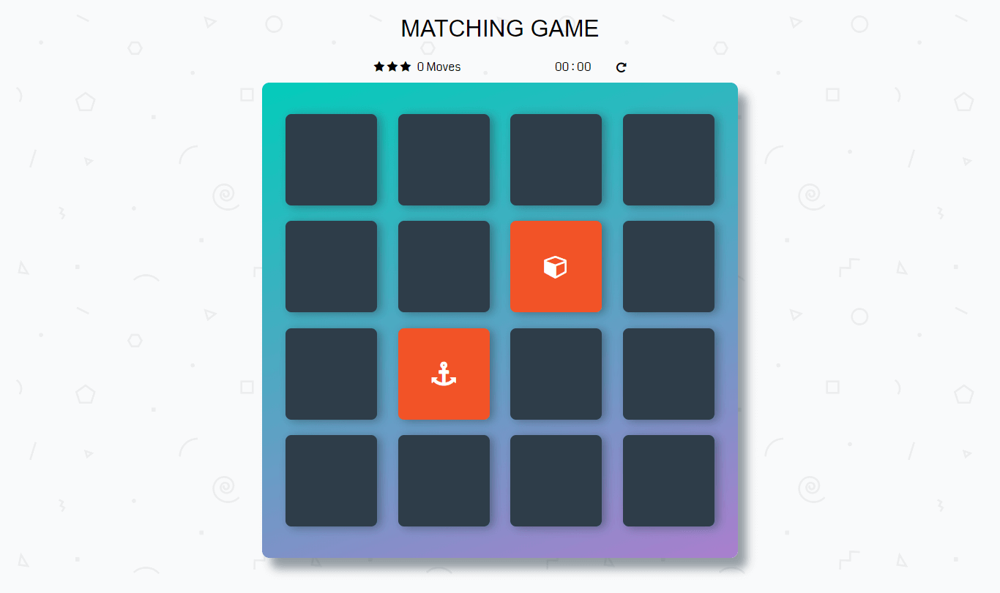
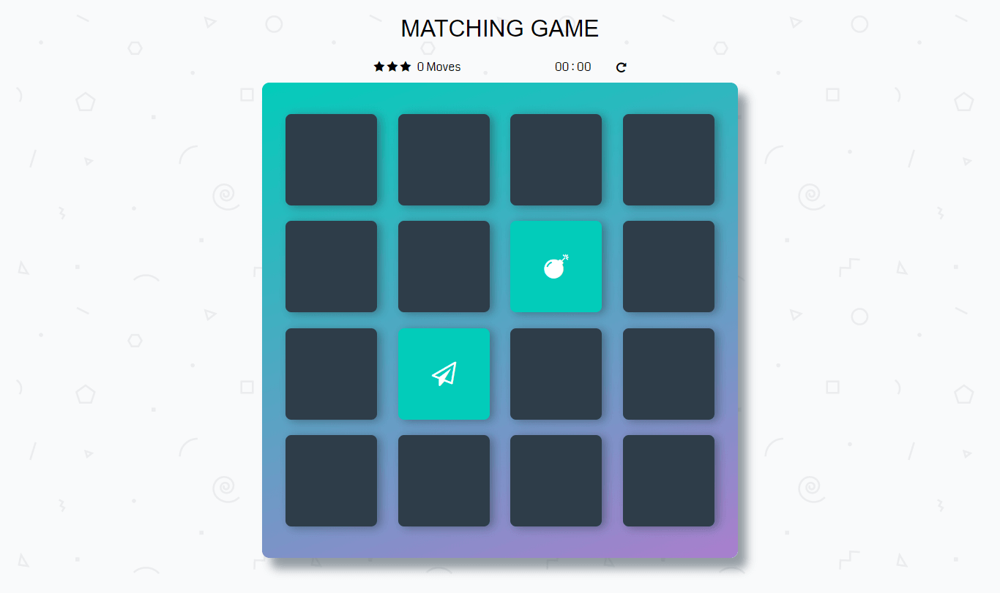
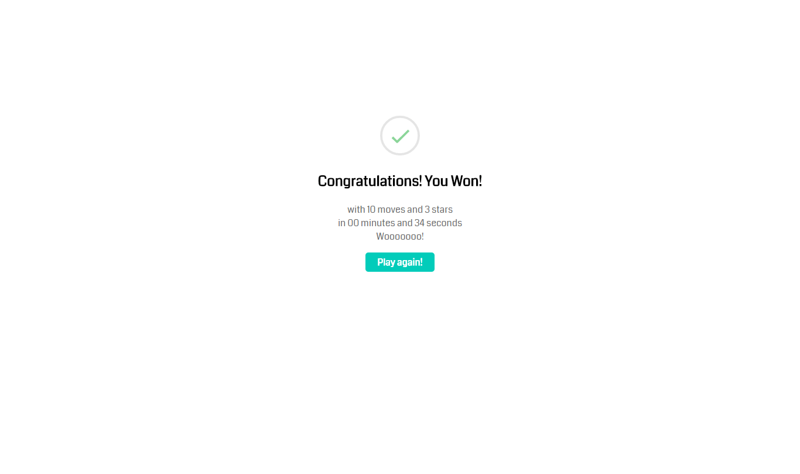
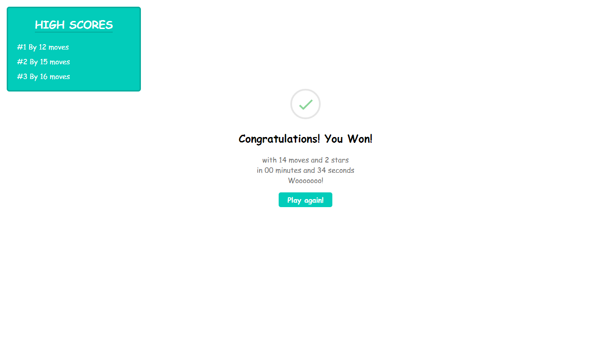

# Udacity-fend memory game project

Udacity (Front-End Web Developer Nanodegree Project): Memory Game.

## Table of Contents

* [Project Overview](#project-overview)
* [How to play](#How-to-play)
* [Project Specifications](#project-specifications)
* [Acknowledgements](#acknowledgements)
* [Contributing](#contributing)

## Project Overview

This (fend) project aims to :
put my HTML, CSS, and JavaScript skills on a real project
by building a browser-based card matching game.

### How The Game Works

The game board consists of sixteen "cards" arranged in a grid. The deck is made up of eight different pairs of cards, each with different symbols on one side. The cards are arranged randomly on the grid with the symbol face down. The gameplay rules are very simple: flip over two hidden cards at a time to locate the ones that match.

At each turn:
-   The player flips one card over to reveal its underlying symbol.
-   The player then turns over a second card, trying to find the corresponding card with the same symbol.
-   If the cards match, both cards stay flipped over.
-   If the cards do not match, both cards are flipped face down.

The game ends once all cards have been correctly matched.

And there is a leaderboard :
-   Represent high scores.
-   If you scored a new high score it highlights it and saves it.

### Screenshots

-   Game start screen

-   Incorrect match action

-   Correct match action

-   Game win action

-   High scores if you didn't get a high one.

-   High scores if you successfully get a high one.

### Game Functionality

In the real-life game, players flip over cards to locate the pairs that match. The goal is to recreate this. These are the events that need to be handled:
-   Flipping cards
-   What happens when cards match
-   What happens when cards do not match
-   When the game finishes

## How to play

You can play the game from [here](https://magdi-mohammed.github.io/udacity-fend-project-memory-game/)
or you can [clone](https://github.com/magdi-mohammed/udacity-fend-project-memory-game) it.

## Project Specifications

### Game Behavior

| Criteria              | Specifications    |
| --------------------- | ----------------- |
| Memory Game Logic     | The game randomly shuffles the cards. A user wins once all cards have successfully been matched. |
| Congratulations Popup | When a user wins the game, a modal appears to congratulate the player and ask if they want to play again. It should also tell the user how much time it took to win the game, and what the star rating was. |
| Restart Button        | A restart button allows the player to reset the game board, the timer, and the star rating. |
| Star Rating           | The game displays a star rating (from 1-3) that reflects the player's performance. At the beginning of a game, it should display 3 stars. After some number of moves, it should change to a 2 star rating. After a few more moves, it should change to a 1 star rating. |
| Timer                 | When the player starts a game, a displayed timer should also start. Once the player wins the game, the timer stops. |
| Move Counter          | Game displays the current number of moves a user has made. |

### Interface Design

| Criteria              | Specifications    |
| --------------------- | ----------------- |
| Styling               | Application uses CSS to style components for the game. |
| Usability             | All application components are usable across modern desktop, tablet, and phone browsers. |

### Documentation

| Criteria              | Specifications    |
| --------------------- | ----------------- |
| README                | A `README` file is included detailing the game and all dependencies. |
| Comments              | Comments are present and effectively explain longer code procedure when necessary. |
| Code Quality          | Code is formatted with consistent, logical, and easy-to-read formatting as described in the [Udacity JavaScript Style Guide](http://udacity.github.io/frontend-nanodegree-styleguide/javascript.html). |

## Acknowledgements

-   [jQuery](https://jquery.com), The fast, small, and feature-rich JavaScript library which saved my time.
-   [Font Awesome](https://fontawesome.com/), for the vector icons
-   [Animate.css](https://github.com/daneden/animate.css), for my project cool, fun, and cross-browser animations.
-   ES06 thanks for the template literal and for-of loop ...

## Contributing

This repository is for a project for the Front-End Web Developer NanoDegree program at Udacity. Therefore, pull requests will not be accepted.

For details, check out [CONTRIBUTING.md](CONTRIBUTING.md).
